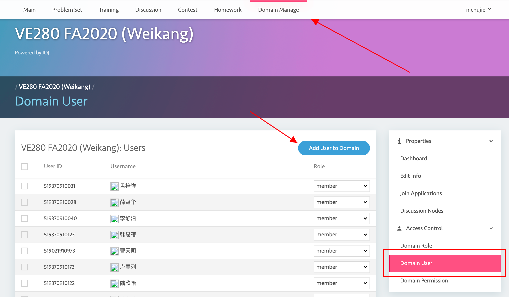
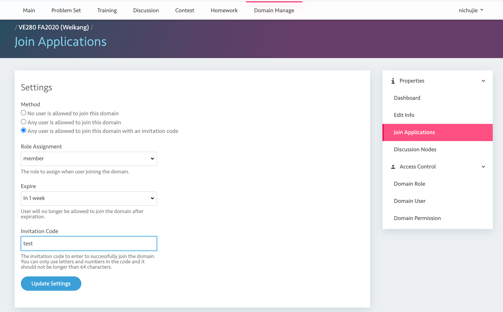

# Member managemet

## Management

After you enter the domain, you could add members manually at the below page, and set access control for them.

- root: domain root user. We recommend TA to be root user.
- admin: admin for the domain. Same as admin root user for most conditions. 
- member: normal member. It is the role for students
- Others not mentioned: ignore it.

## Invitation

Fill in the infomation below then you can generate a invitation link. You can share the link via Canvas annoucement to let students join in the course domain.

Note:

- Do not choose role other than **member**

