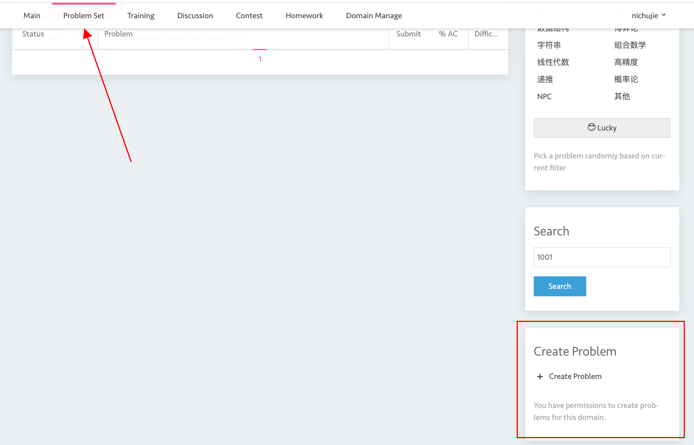
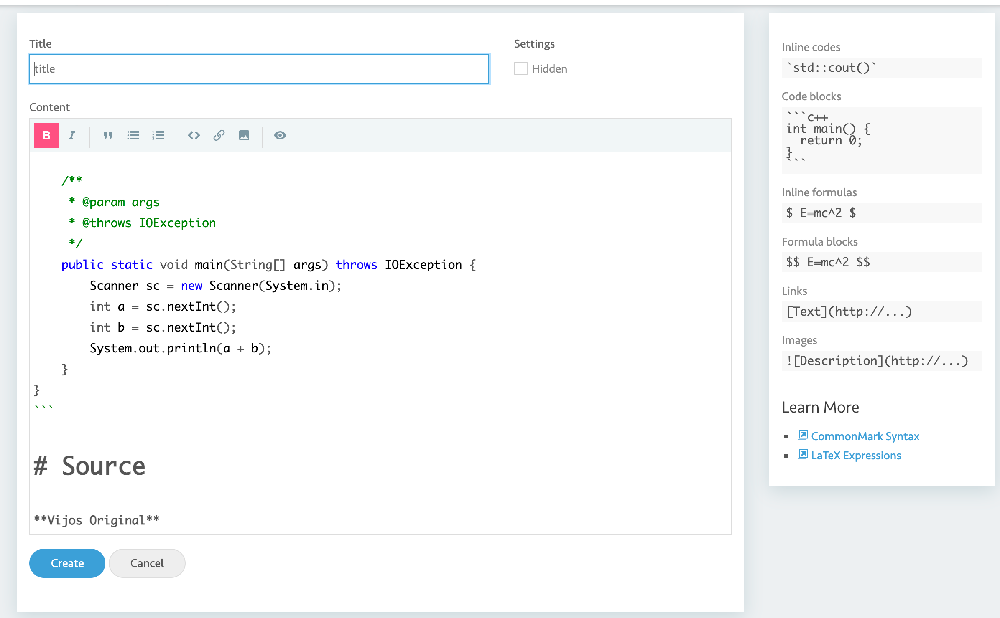
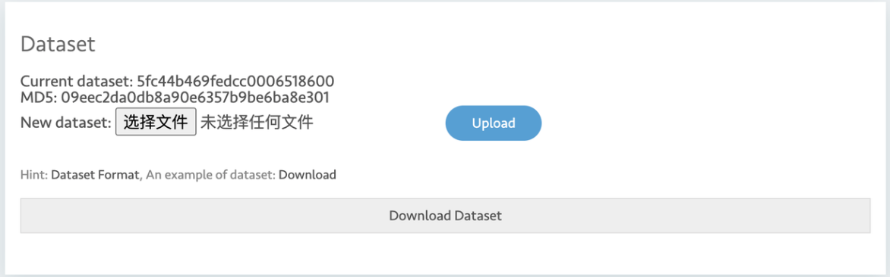
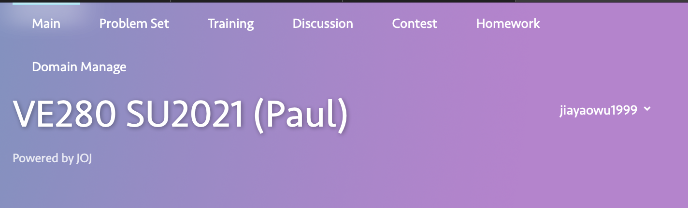
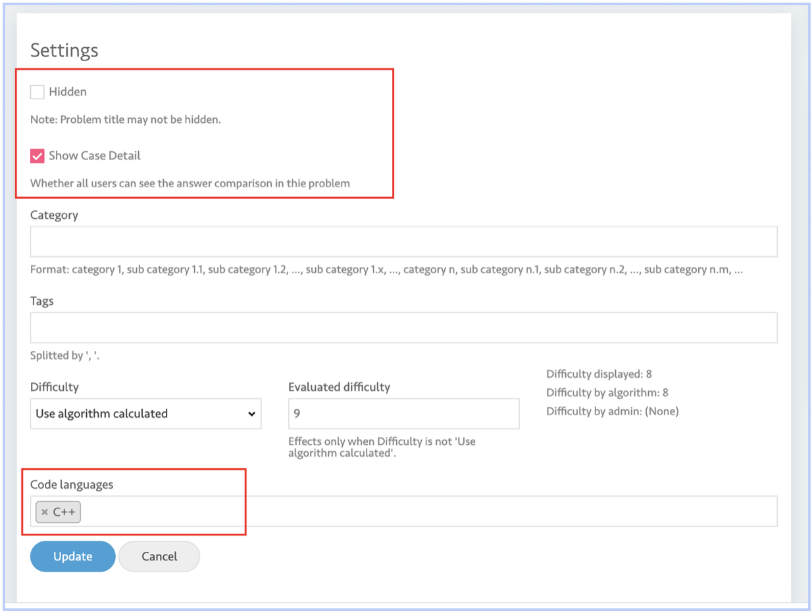

# Create and set problem

## Create Problem

Shown in the below image, scroll down until you see a **Create Problem** button in the bottom right.

Click that button. then you will be navigated to the below image. 

After inputting the title and problem description (support markdown), you could click **Create** to submit. Case settings are not here.

## Set the problem

Then (on the right of the page) go to **Settings** of the problem. The below part is the part for updating your testcases. 

- We only accept `.zip` File

`Note: When preparing the zip file, please select all the files you would like to zip, and zip them. `

`DO NOT zip the folder that contains all the files`

- Q: How can I get an idea of how to write the testcases?
- A: Check the last-year(or last-semester)-course domain. If you do not have access, contact joj admin to get you in. Then go the **Problem Set** to seek for the same problem in the last domain. Go to the **Settings** and Click **Download Dataset**

## Other Settings

Among the below settings, highlighted components are those that are actually used. Ignore the rest of them.

To here, the upload is OK. YOu could then submit with your own code to test whether the code works.