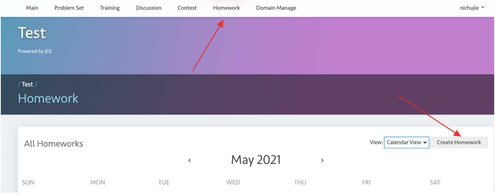
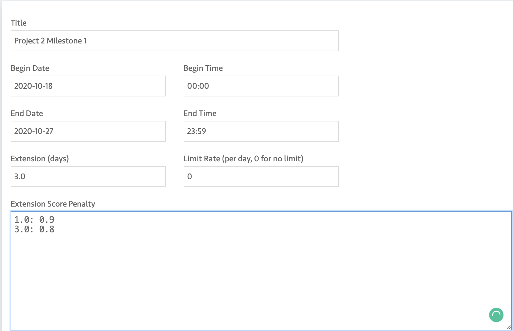
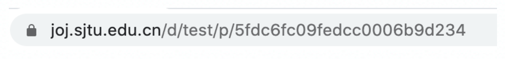
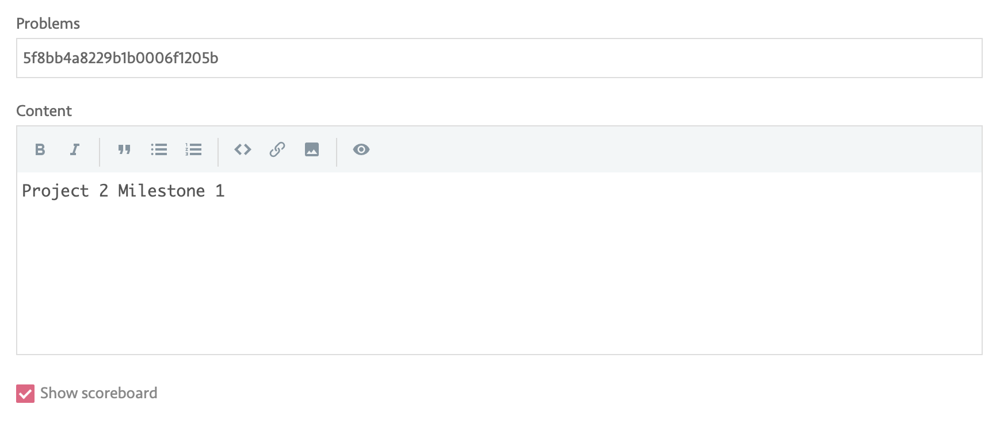

# Create and Set Homework

## Create homework

To make an assignment on JOJ, you should first prepare a problem in JOJ for each problem in your assignment. Then create a homework to manage the deadline, the grade.

## (Create and Edit) homework

Below is a recipe for VE482 for example.

- Begin Date: The earliest time that students can submit

- End Date: The latest time that students can submit without deduction

- Extension (days): A time period after the due time (measured in days) that students can handle their homework but will receive deduction. Students cannot submit after this peroid ends.

- Extension Score Penalty: follow the example in the below image. `1.0: 0.9` means that students who submit between 0 days after deadline and 1 days after deadline will receive 10% deduction of their grade to 90%

- Problems: all the problems used in this assignment. You should type in their problem ids. To find the problem ID, access the problem page first and check its url. The string after `/d/test/p/` is its id.

  

- Show Scoreboard: whether students can see the scoreboard. You can close to prevent involution.

