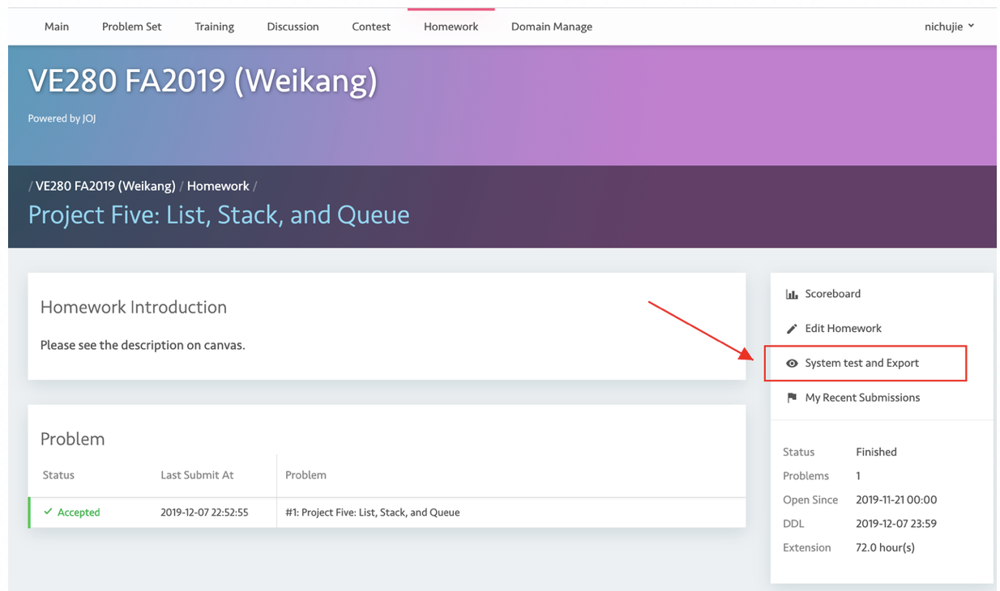
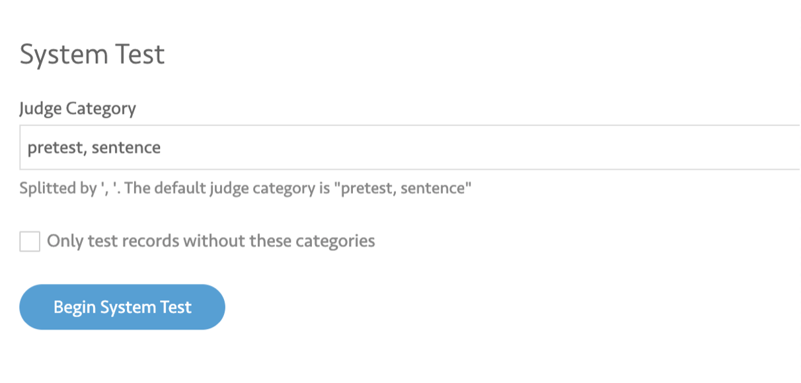

# Judge

We often have hidden cases.

Hidden cases are those cases that student will not see or be judged with when students submit their code themselves. We define this submit-then-test  judge process as **pretest** judge.

We will test students code with hidden cases after their submission. We call this system test or **sentence** judge.

## Pretest Judge

Will be done right after student submit their code.

## System Test or Sentence Judge

To perform system test,

- wait until everyone finish their submission
- Go to **System Test and Export**  in the Menu

**Do not** check the checkbox below.

