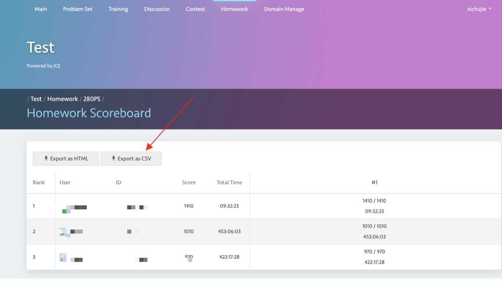
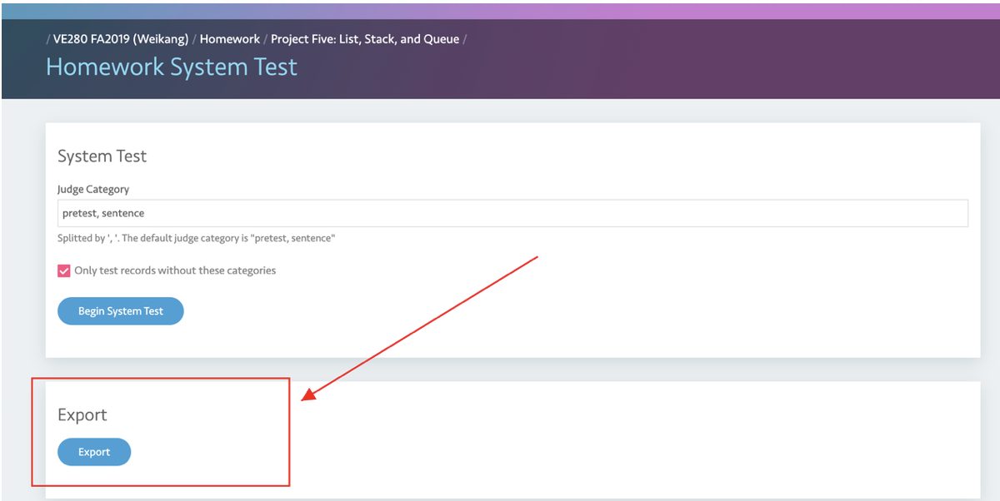

# Export

## Export Grades

Go to **Homework -> Scoreboard** and click **Export as CSV**. You will get a CSV file contains all grade.

Notice that there are two numbers in the grade display. It is calculated grade/actual grade, rather than score/full score.

Note that we have a script that could help you input all the grades on Canvas based on the CSV file. If you are interested, please contact Jiayao.

## Export Code

In System Test, click the second **Export** button to download all the code.

