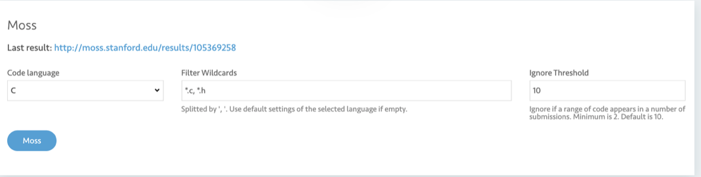

# Moss Code Check

## NOTICE!!!!!

**This function may lead to the collapse of JOJ.**Please used it as less as possibl or use it in midnight. If JOJ collapses, please contact JOJ admin as soon as possible.

## How to use

The part below System Test is Moss Code Check

- Code Languages: The coding language for check

- Filter Wildcards: The files to check

- Ignore Threshold: if similar line numbers are less than this number, the two code file will not be regarded as plagiarism.

