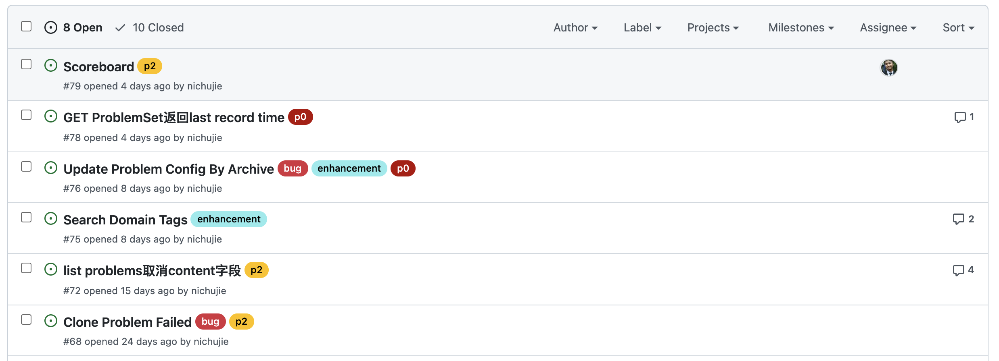

# Joint Online Judge

## JOJ 1.0

Check the docs about [grading with JOJ 1.0](/GradeWithJOJ)

## JOJ 2.0

JOJ 2.0 is consist of:

- cattle (frontend)
- tiger (judger)
- horse (backend)
- elephant (problem configuration)
- ...
- mouse (moss)
- rabbit (mq)

## Developer's Guide

Check [Developer's Guide](./developer.md).

## GitHub Workflow

### Issues & Discussions

Try to post your confusions and bugs in the corresponding issues panel on GitHub. You can put labels, or assign it to someone.

### Have Your Own Branch

!!! note

    Never commit & push directly to the master branch, unless there are special conditions.

Checkout a branch with you nickname, a slash `/`, and a description of the branch. For example: `nichujie/login-page`.

### Commit Message

Please refer to the Angular commit message [format](https://github.com/angular/angular/blob/master/CONTRIBUTING.md#commit). Or you can learn from our commit history.

!!! note

    For the sake of your colleagues' mental health, please keep the commit history clean and tidy.

### Pull Request

!!! note

    Usually, a pull request replies to an issue, a feature, or a bug fix. Do not include dozens of code in a single pull request. Typically, 250 lines is the maximum of a single pull request (exceeding a little is acceptable).

Start a pull request after you have finished some coding. The code will be merged after the reviewers accepted your code.

